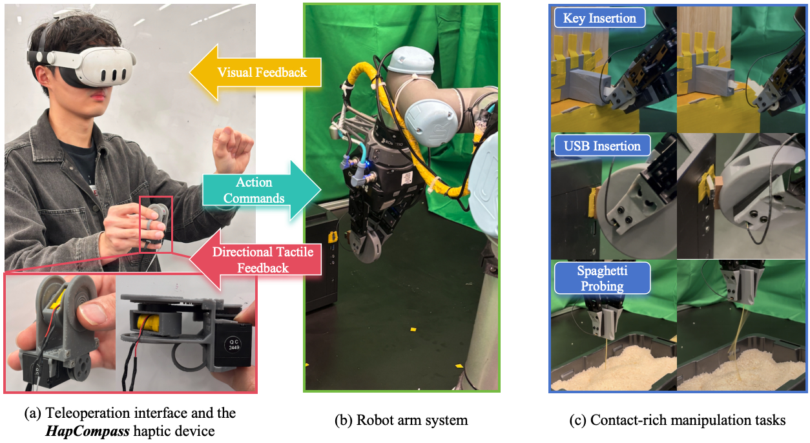

<div align="center">
  <h1>HapCompass: A Rotational Haptic Device for Contact-Rich Robotic Teleoperation</h1>

  <p>
    <a href="https://vincent-tann.github.io">Xiangshan Tan</a><sup>1</sup>,
    <a href="https://scholar.google.com/citations?user=DeQM4Z4AAAAJ&hl=en">Jingtian Ji</a><sup>1</sup>,
    <a href="http://tianchong-jiang.github.io/">Tianchong Jiang</a><sup>1</sup>,
    <a href="https://plopes.org/">Pedro Lopes</a><sup>2</sup>,
    <a href="https://home.ttic.edu/~mwalter/">Matthew R. Walter</a><sup>1</sup>
  </p>

  <p>
    <sup>1</sup>Toyota Technological Institute at Chicago (TTIC),
    <sup>2</sup>University of Chicago
  </p>

  <p><em>ICRA 2026</em></p>

  <p>
    <a href="https://ripl.github.io/HapCompass/">Project Page</a> |
    <a href="https://arxiv.org/abs/2603.30042">Paper</a> |
    <a href="https://github.com/ripl/HapCompass/tree/main/hardware">Hardware</a>
  </p>
</div>



## Overview
***HapCompass*** is a wearable haptic device for contact-rich robotic teleoperation that renders 2D directional cues by **mechanically rotating a single linear resonant actuator (LRA)**, whose asymmetric vibration provides directional haptic feedback. By mapping the robot's tactile measurements into directional feedback for the operator, it improves teleoperation performance on contact-rich tasks and leads to higher-quality demonstrations for imitation learning.

## TODO

### Webpage

- [x] ~~Build the project webpage (Mar 11)~~
- [ ] Upload a policy rollout video
- [x] ~~Add an arXiv link (Apr 1)~~

### Hardware

- [x] ~~Upload the Fusion source design and STL files (Mar 31)~~
- [x] ~~Write BOM (Mar 31)~~
- [x] ~~Write assembly instructions (Apr 1)~~
- [ ] Write "Modifying Source Design"

### Software

- [ ] Upload the code for device control
- [ ] Upload the code for tactile mapping
- [ ] Upload the code for teleoperation

## Hardware

Bill of materials (BOM), assembly instructions, editable source design (.f3z), and printable parts (.stl) can be found in the [`hardware/`](hardware/) directory.


## BibTeX

```bibtex
@inproceedings{tan2026hapcompass,
  author    = {Tan, Xiangshan and Ji, Jingtian and Jiang, Tianchong and Lopes, Pedro and Walter, Matthew R.},
  title     = {HapCompass: A Rotational Haptic Device for Contact-Rich Robotic Teleoperation},
  booktitle = {Proceedings of the IEEE International Conference on Robotics and Automation (ICRA)},
  year      = {2026},
}
```
