## Contents

- [Introduction](#introduction)
- [Bill of Materials (BOM)](#bill-of-materials-bom)
- [3D Printing Parts](#3d-printing-parts)
- [Critical Dimensions](#critical-dimensions)
- [Mechanical Assembly](#mechanical-assembly)
- [Electronic Assembly](#electronic-assembly)
- [Modifying the Source Design](#modifying-the-source-design)

## Introduction

This document provides the hardware documentation for HapCompass.
Please note that we made slight modifications to the version described in the paper to improve the mechanical stability of the device.

## Bill of Materials (BOM)

<table>
  <tr>
    <th>Name</th>
    <th>Quantity</th>
    <th>Specifications</th>
    <th>Image</th>
    <th>Link</th>
    <th>Price (USD)</th>
    <th>Notes</th>
  </tr>
  <tr>
    <td>LRA</td>
    <td>1</td>
    <td>Titan Haptics TacHammer DRAKE LFi (4ohm)</td>
    <td>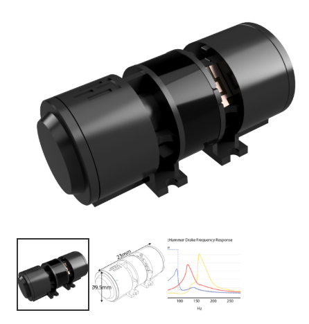</td>
    <td><a href="https://titanhaptics.com/drake/">Product Link</a></td>
    <td>$180/4 pieces</td>
    <td></td>
  </tr>
  <tr>
    <td>Servo Motor</td>
    <td>1</td>
    <td>Dynamixel XL330-M077-T</td>
    <td>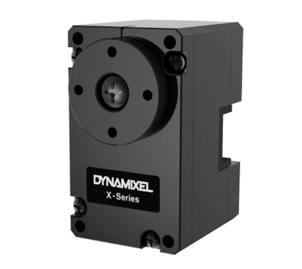</td>
    <td><a href="https://robotis.us/dynamixel-xl330-m077-t/">Product Link</a></td>
    <td>$27.49</td>
    <td></td>
  </tr>
  <tr>
    <td>Driving Belt</td>
    <td>1</td>
    <td>MXL trade size, width 1/8'', outer circle 5.6'', 70 teeth, pitch 0.08''
    <td>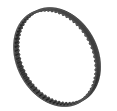</td>
    <td><a href="https://www.mcmaster.com/products/1679k71/">Product Link</a></td>
    <td>$1.63</td>
    <td></td>
  </tr>
  <tr>
    <td>Ball Bearing</td>
    <td>2</td>
    <td>Inner diameter 5mm, outer diameter 8mm, width 2.5mm</td>
    <td>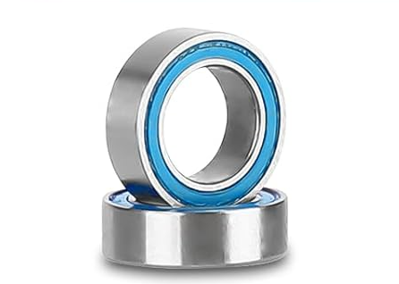</td>
    <td><a href="https://www.amazon.com/dp/B0DNT3ZKY6">Product Link</a></td>
    <td>$14/1 pack</td>
    <td></td>
  </tr>
  <tr>
    <td>O-ring</td>
    <td>2</td>
    <td>Inner diameter 20mm, outer diameter 22mm, width 1mm</td>
    <td></td>
    <!-- <td><a href="https://www.amazon.com/dp/B07FRCKJQG?th=1">Product Link</a></td> -->
    <td><a href="https://www.amazon.com/uxcell-22mmx1mm-Nitrile-Resistant-Grommets/dp/B01N8RPR5X">Product Link</a></td>
    <!-- <td>$7.09/1 pack</td> -->
    <td>$6.49/1 pack</td>
    <td>Optional</td>
  </tr>
  <tr>
    <td>Screws & Nuts</td>
    <td>3</td>
    <td>M2*4mm</td>
    <td>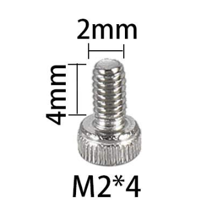</td>
    <td><a href=https://www.amazon.com/HanTof-Washers-Assortment-Machine-Stainless/dp/B082XRX17Z?th=1">Product Link</a></td>
    <td>-</td>
    <td></td>
  </tr>
  <tr>
    <td>Audio Amplifier Board</td>
    <td>1</td>
    <td>PAM8406 Amplifier Board 5V</td>
    <td>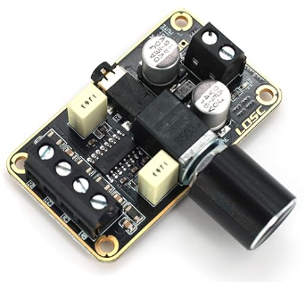</td>
    <td><a href="https://www.amazon.com/DEVMO-Amplifier-PAM8406-Digital-Channel/dp/B0899X1Y5X/?th=1">Product Link</a></td>
    <td>$13</td>
    <td></td>
  </tr>
  <tr>
    <td>Servo Driver Board</td>
    <td>1</td>
    <td>Waveshare Serial Bus Servo Driver Board</td>
    <td>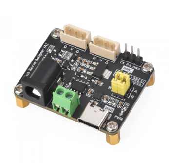</td>
    <td><a href="https://www.waveshare.com/product/bus-servo-adapter-a.htm">Product Link</a></td>
    <td>$5</td>
    <td></td>
  </tr>
</table>

## 3D Printing Parts

We printed all parts using a Formlabs Form 3 printer (using Grey resin material, 0.050mm layer thickness). We provide the `.stl` files of all parts under [`stl/`](stl/) folder.

<table>
  <tr>
    <th>Name</th>
    <th>Quantity</th>
    <th>stl file</th>
    <th>Image</th>
  </tr>
  <tr>
    <td>Rotor</td>
    <td>1</td>
    <td><a href="./stl/Rotor_bare_pulley.stl">Rotor_bare_pulley.stl</a></td>
    <td>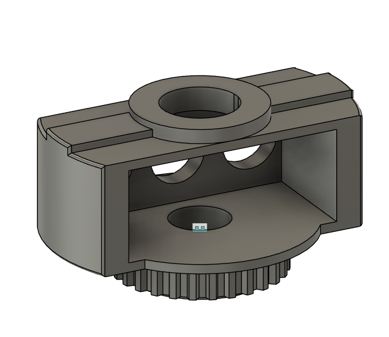</td>
  </tr>

  <tr>
    <td>Motor Pulley</td>
    <td>1</td>
    <td><a href="./stl/Motor_Pulley.stl">Motor_Pulley.stl</a></td>
    <td>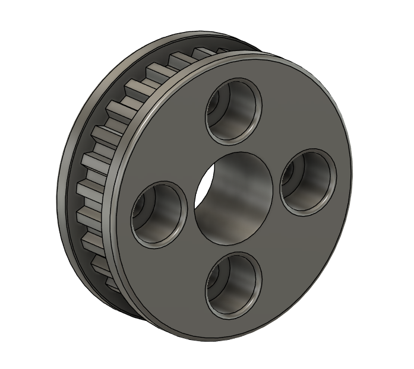</td>
  </tr>

  <tr>
    <td>Shell - Upper Outer</td>
    <td>1</td>
    <td><a href="./stl/Shell_upper_outside.stl">Shell_upper_outside.stl</a></td>
    <td>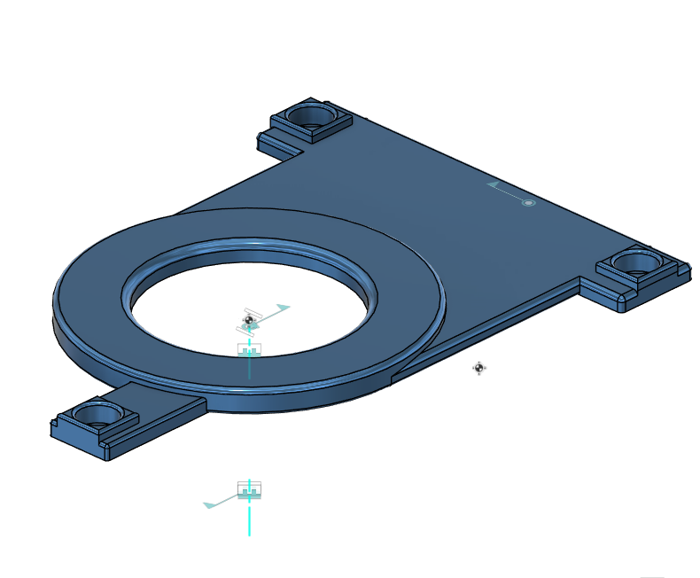</td>
  </tr>

  <tr>
    <td>Shell - Upper Inner</td>
    <td>1</td>
    <td><a href="./stl/Shell_upper_inside.stl">Shell_upper_inside.stl</a></td>
    <td>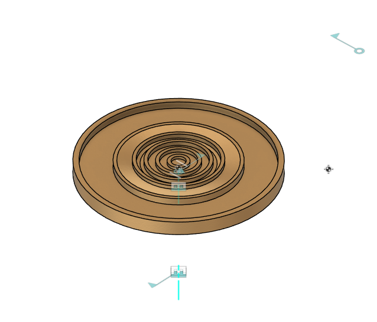</td>
  </tr>

  <tr>
    <td>Shell - Bottom Outer</td>
    <td>1</td>
    <td><a href="./stl/Shell-bottom-outside.stl">Shell-bottom-outside.stl</a></td>
    <td>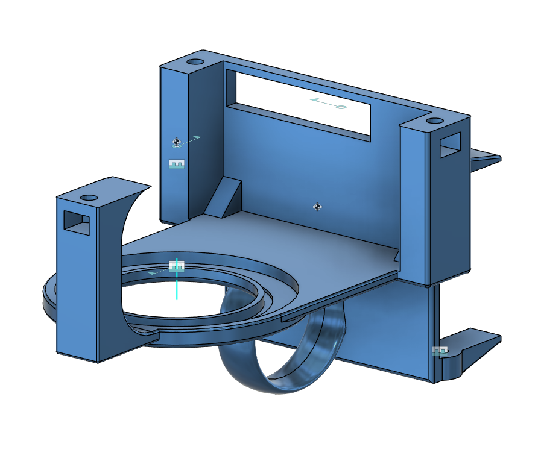</td>
  </tr>

  <tr>
    <td>Shell - Bottom Inner</td>
    <td>1</td>
    <td><a href="./stl/Shell-bottom-inside.stl">Shell-bottom-inside.stl</a></td>
    <td>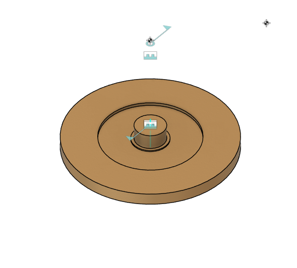</td>
  </tr>
</table>

## Critical Dimensions

Some dimensions of the HapCompass are critical to vibration transmission. If the fit is too tight, the device may be difficult or impossible to assemble; if it is too loose, a significant portion of the vibration energy may dissipate before reaching the user's fingertip.

The effective vibration transmission path is: 
- LRA -> Rotor -> Ball Bearings -> Inner Shells (yellow) -> Fingertip

Therefore, the dimensions shown in the figure below are critical to vibration transmission:

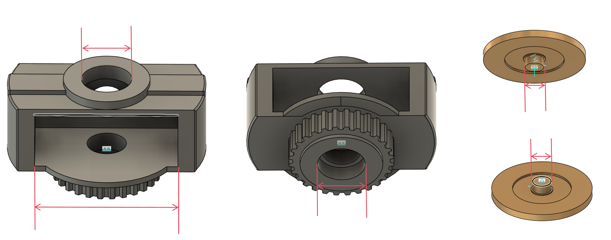

Due to hardware variations, such as differences between 3D printers or slight variations in bearing diameter, you *might* need to adjust these dimensions. If you find that:
- the fit is so tight that assembly is almost impossible; or
- the fit is loose enough that some parts can move slightly along these dimensions (for example, the LRA can move slightly along its vibration axis inside the rotor),

then you can adjust these dimensions by [modifying the source design](#modifying-the-source-design).

## Mechanical Assembly

Step 1: Attach the two bearings and the two inner shells to the rotor.

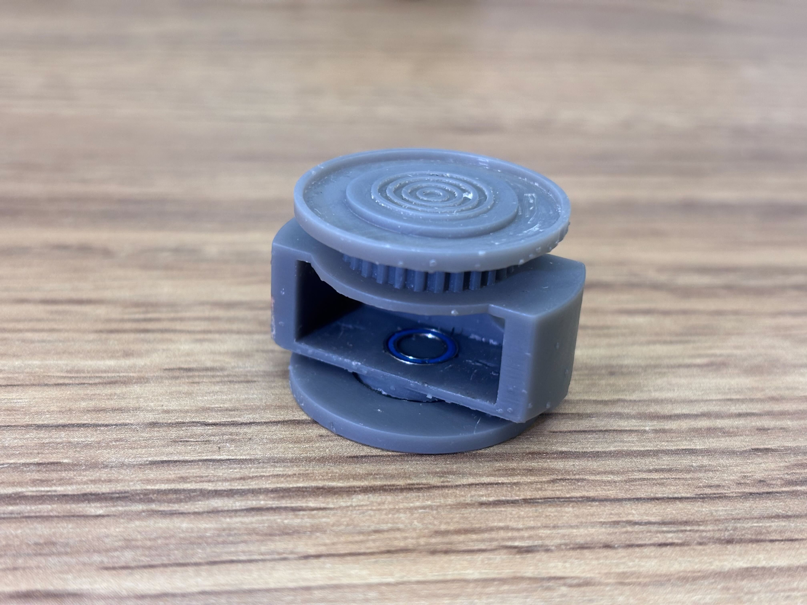

Step 2: Attach the motor pulley to the servo motor (using the short screws from the servo package).

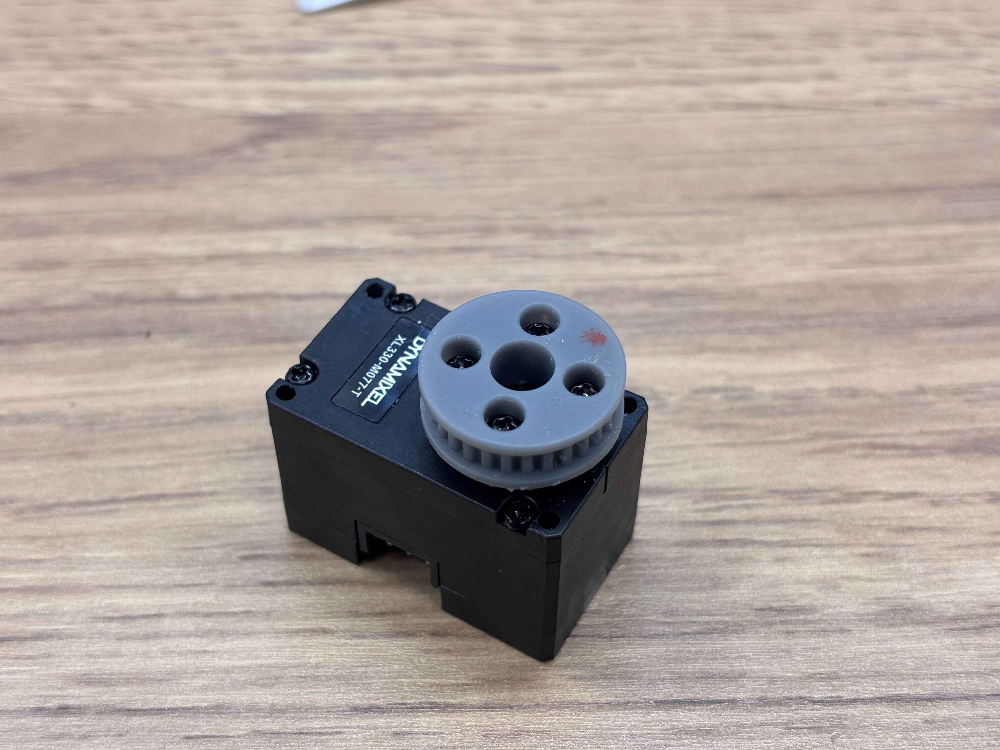

Step 3: Pass the driving belt through the long slot in the shell, then mount the servo to the shell (using the long screws from the servo package).

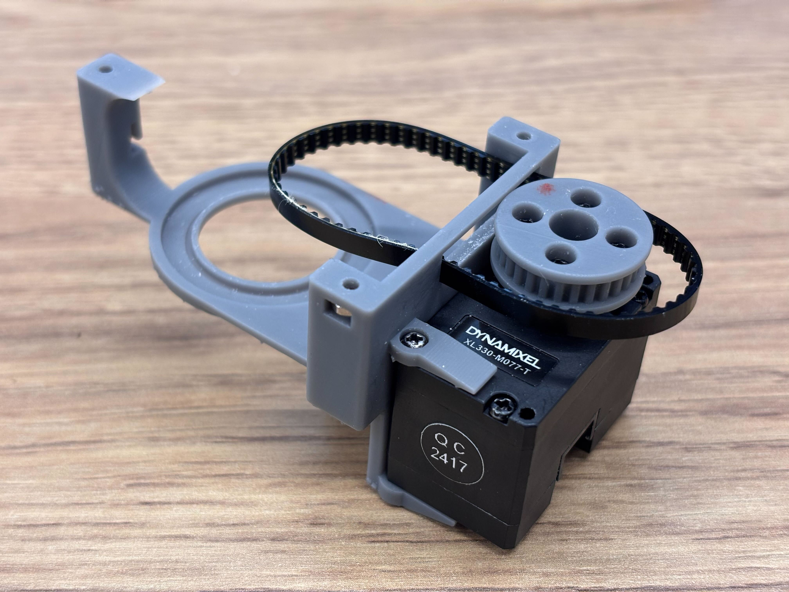

Step 4 (Optional): install the two rubber O-rings to the outer shells. This step may be easier if you use tweezers and a small amount of glue.

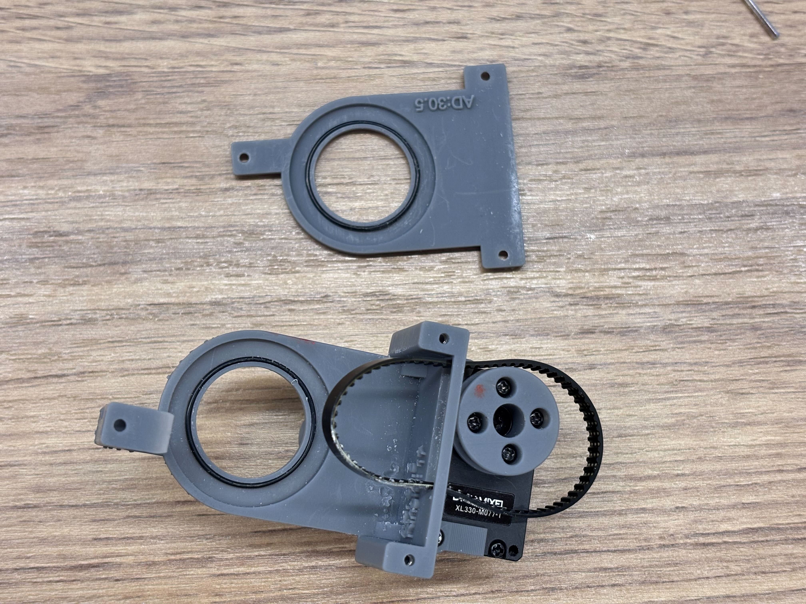

Step 5: Fit the belt around the pulley and the rotor.

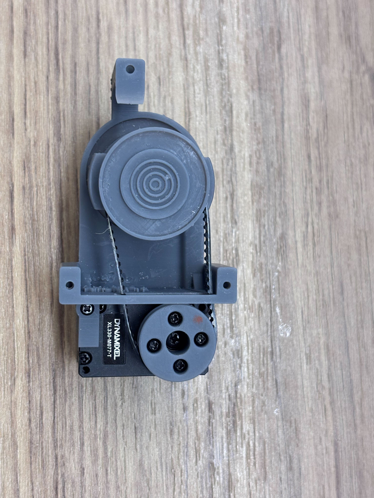

Step 6: Assemble the upper shell and the bottom shell using screws and nuts.

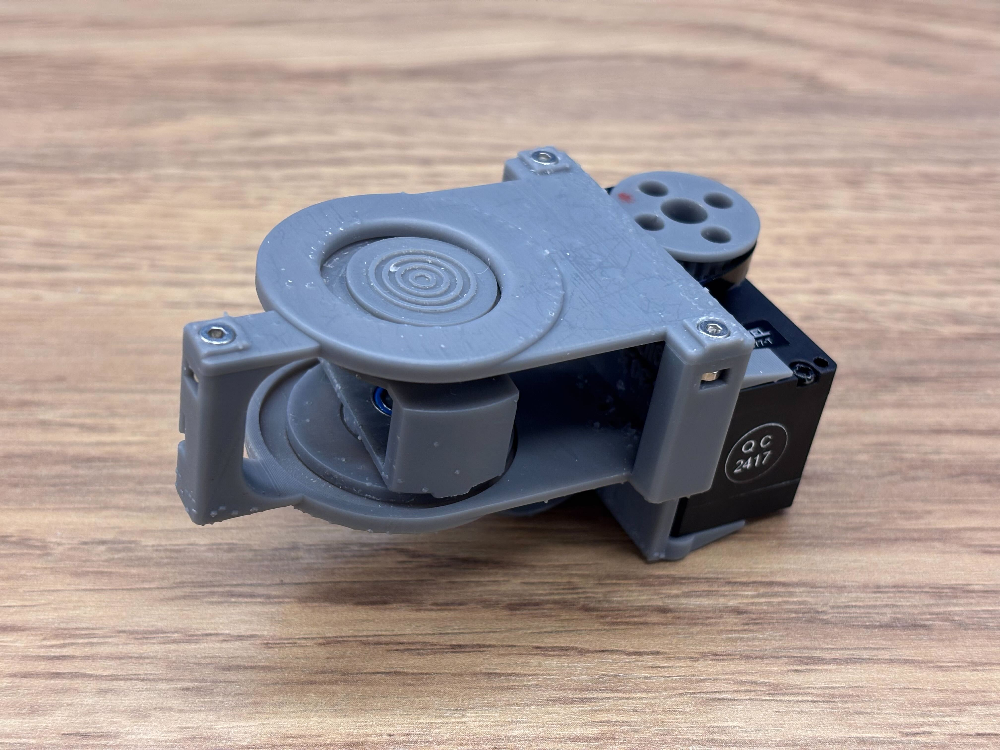

## Electronic Assembly

Step 1: The wires on the Drake actuator (LRA) are very short when purchased (left), so extend them by soldering on additional wire (right).

Step 2: Install the LRA into the rotor. The arrow indicates the direction of the pulling sensation produced by the asymmetric vibration.

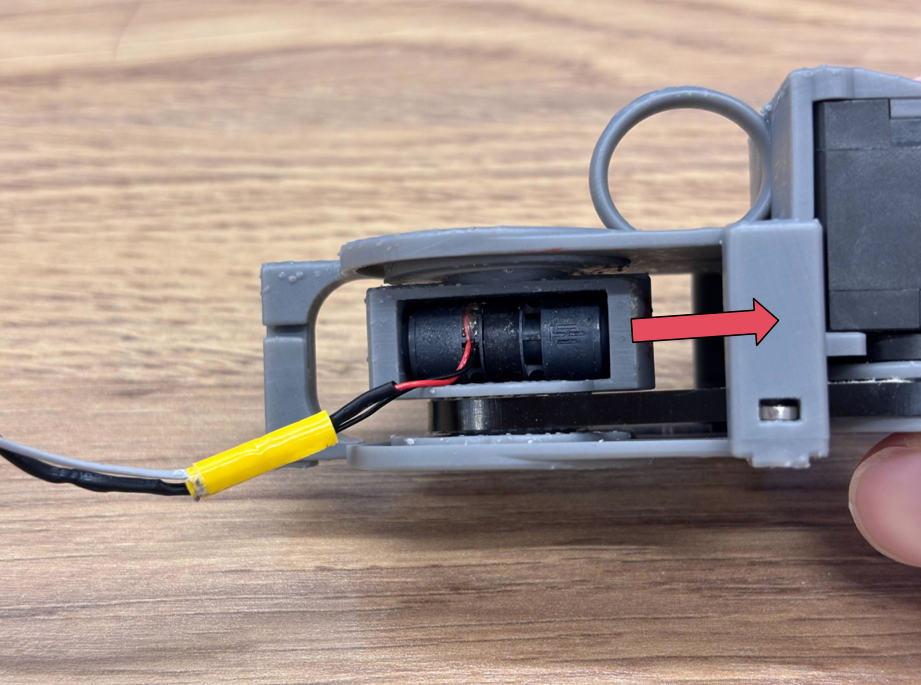

Step 3: Connect the LRA wires to the right-channel output of the audio amplifier board, making sure to observe the correct polarity. Connect the board to the PC's speaker output using a 3.5 mm audio cable, and connect a 5 V power supply to the board.

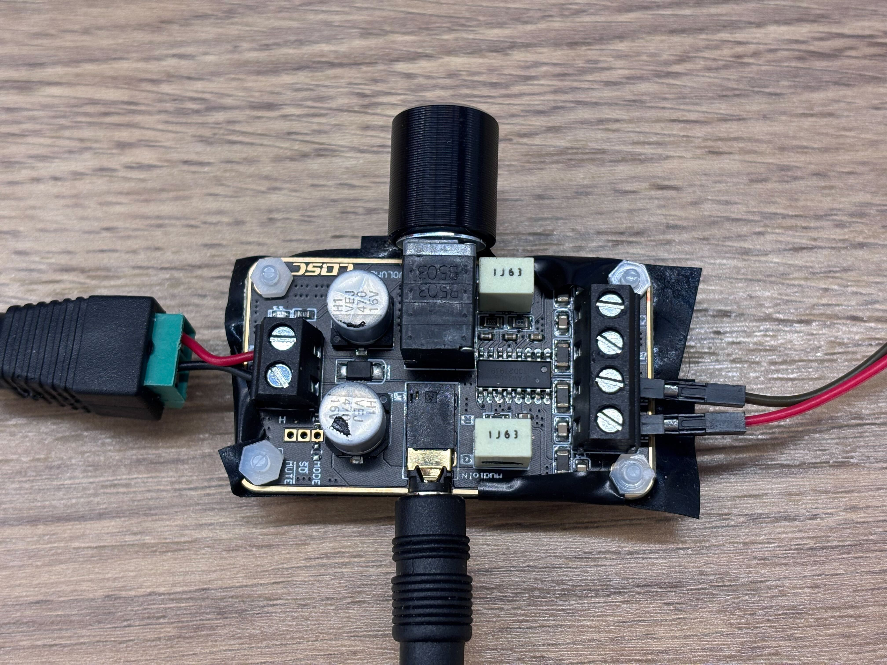

Step 4: Connect the servo to the driver board with extended wires. For connector details, see the [XL330-M077 Connector Information](https://emanual.robotis.com/docs/en/dxl/x/xl330-m077/#connector-information). Then connect the board to the PC using a USB-C cable, and connect a 5 V power supply to the board.

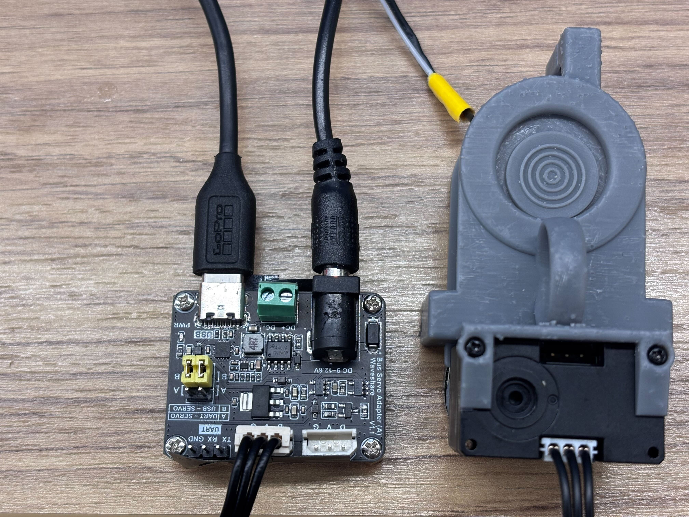

## Modifying the Source Design
Coming soon.